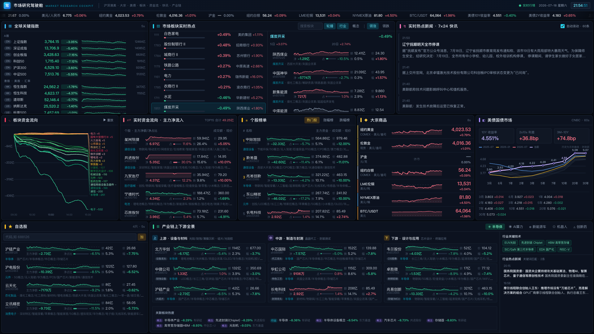
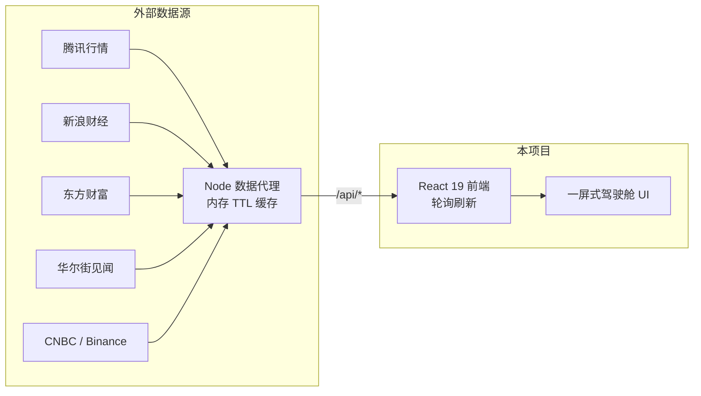

<div align="center">

# 📊 市场研究驾驶舱

**Market Research Cockpit — 面向金融与产业研究的一屏式实时行情大屏**

聚合 A股 / 港股 / 美股 · 大宗商品 · 美债收益率 · 板块热点 · 资金流 · 7×24 快讯 · 产业链自选股

[](https://react.dev)
[](https://vite.dev)
[](https://www.typescriptlang.org)
[](https://tailwindcss.com)
[](https://nodejs.org)
[](LICENSE)

</div>



## ✨ 功能亮点

- **🌍 全球市场一屏掌握** — 沪深 / 恒生 / 道琼斯 / 纳斯达克 / 标普 / VIX / 美元人民币汇率，指数分钟级走势同屏联动
- **🥇 大宗商品与加密货币** — 纽约金银、伦敦金、沪金、伦铜、原油、BTC，价格与日内曲线实时刷新
- **💵 美债收益率监控** — 10Y / 2Y 收益率、2s10s 利差、收益率曲线形态与历史月度变迁
- **🔥 板块热点雷达** — 行业 / 概念板块涨跌排行，点击板块联动成分股、龙头股与资金流
- **💰 资金流向追踪** — 个股主力净流入 TOP 榜、板块资金分钟级累计曲线、热门股 / 涨幅 / 跌幅榜单
- **⛓️ 产业链全景** — 半导体、AI 算力、新能源车、机器人、创新药五条产业链，上中下游标的分层展示并联动行情
- **📰 7×24 快讯聚合** — 全球财经快讯滚动播报，宏观关键词与产业链关联新闻自动高亮
- **⚡ 零依赖数据服务** — 内置 Node 代理聚合公开行情接口，内存缓存减压，无需 API Key，开箱即用

## 🏗️ 架构



- 前端优先请求本站 Node 代理；代理不可用时，部分接口（腾讯系 / 见闻）自动降级为浏览器直连
- 服务端按接口粒度设置缓存 TTL（行情 1.5s ~ 板块归属 24h），无数据库、无外部存储
- 生产环境单进程运行：同一端口同时提供 API 与前端静态文件

## 🚀 快速开始

### 先决条件

- Node.js 18+
- 系统可用 `curl`（部分代理接口使用）

### 本地开发

```bash
npm install     # 或 pnpm install
npm run dev
```

- 前端开发服务器：<http://localhost:3000>
- 数据代理服务：<http://localhost:3001>（Vite 自动将 `/api` 代理过去）

### 生产部署

```bash
npm run build   # 构建到 dist/
npm start       # 单进程启动，访问 http://localhost:3000
```

### Docker

```bash
docker build -t market-cockpit .
docker run -p 3000:3000 market-cockpit
```

## 📡 API 一览

开发时前端通过 `/api` 访问本地代理服务：

| 接口 | 说明 |
| --- | --- |
| `/api/quotes?codes=...` | 指数 / 个股实时报价 |
| `/api/minute?code=...` | 日内分钟走势 |
| `/api/boards?type=...&dir=...&n=...` | 行业 / 概念板块排行 |
| `/api/board-stocks?code=...&n=...` | 板块成分股 |
| `/api/futures?list=...` | 大宗商品 / 加密货币报价 |
| `/api/future-minute?code=...` | 期货日内走势 |
| `/api/rank?sort=...&n=...` | 个股榜单（涨幅 / 成交额 / 换手率） |
| `/api/moneyflow?n=...` | 个股主力净流入排行 |
| `/api/stock-flows?codes=...` | 批量个股资金流 |
| `/api/board-flow?n=...` | 板块资金流向曲线 |
| `/api/stock-boards?code=...` | 个股所属板块（行业 / 地域 / 概念） |
| `/api/news?page=...&size=...` | 7×24 财经快讯 |
| `/api/treasuries` | 美债收益率实时值 |
| `/api/treasury-history` | 美债收益率历史曲线 |
| `/api/health` | 健康检查 |

## 🗂️ 项目结构

```
├── server/
│   ├── dev.cjs        # 开发入口：同时启动 Vite 与数据代理
│   └── index.cjs      # 数据代理 + 生产静态文件服务
├── src/
│   ├── App.tsx        # 大屏布局与路由
│   ├── components/
│   │   ├── dash/      # 驾驶舱各面板（指数/板块/资金流/快讯/产业链…）
│   │   └── ui/        # shadcn 风格基础组件库
│   ├── config/        # 指数、商品、产业链等静态配置
│   ├── hooks/         # usePolling 等通用钩子
│   └── lib/           # API 客户端与工具函数
└── docs/              # 截图等文档资源
```

## 🛠️ 技术栈

- **前端**：React 19 · Vite 7 · TypeScript · Tailwind CSS · Radix UI · Recharts
- **后端**：Node.js 原生 `http`（无框架）· `curl` / `fetch`
- **数据源**：腾讯 · 新浪 · 东方财富 · 华尔街见闻 · CNBC · Binance 等公开行情接口

## ⚠️ 免责声明

本项目仅用于学习与研究目的。所有行情数据来自公开网络接口，可能存在延迟或误差，不构成任何投资建议。

## 🤝 贡献

欢迎提交 Issue 或 PR：

1. Fork 本仓库
2. 创建分支 `feature/xxx`
3. 提交修改并推送
4. 发起 Pull Request

## 📄 License

[MIT](LICENSE)
